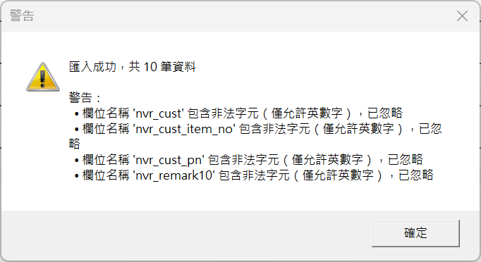

# 匯入警告問題－規格修正案

| 項目 | 內容 |
|------|------|
| 文件版本 | v1.0 |
| 建立日期 | 2026-01-29 |
| 狀態 | **草案** |
| 關聯規格 | raw_spec.md 13.11, 3.3, 附錄 A |

---

## 1. 問題描述

匯入 Excel 資料時，系統顯示大量警告訊息（如下圖），使用者無法快速判斷哪些警告會影響匯入結果。



**警告內容範例：**
```
警告：
• 欄位名稱 'nvr_cust' 包含非法字元（僅允許英數字），已忽略
• 欄位名稱 'nvr_cust_item_no' 包含非法字元（僅允許英數字），已忽略
• 欄位名稱 'nvr_cust_pn' 包含非法字元（僅允許英數字），已忽略
• 欄位名稱 'nvr_remark10' 包含非法字元（僅允許英數字），已忽略
```

---

## 2. 問題原因分析

### 2.1 規格內部矛盾

| 規格位置 | 規定內容 | 衝突說明 |
|----------|----------|----------|
| **13.11** | 「欄位名稱僅允許英數字，不進行自動修正或容錯」 | 過於嚴格 |
| **附錄 A** | 定義欄位名稱包含底線：`nvr_cust`, `nvr_cust_item_no`, `nvr_cust_pn`, `nvr_remark10` | **規格書本身定義的欄位就包含底線** |
| **5.1, 5.2** | 標籤欄位對應使用底線欄位：`nvr_cust → CSCUSTOMER` | 與 13.11 矛盾 |

### 2.2 程式實作問題

```csharp
// ExcelImporter.cs:34
[GeneratedRegex(@"^[A-Za-z0-9]+$")]  // 僅允許英數字，底線被拒絕
private static partial Regex FieldNamePattern();
```

程式依據 13.11 實作，導致所有含底線的欄位名稱被標記為「非法字元」並忽略。

### 2.3 警告等級未區分

目前所有非成功狀態統一顯示為「警告」，缺乏區分：
- **嚴重問題**（會影響輸出）vs **資訊提示**（僅供參考）
- 使用者無法快速判斷是否需要處理

---

## 3. 修正方案

### 3.1 修正 raw_spec 13.11 欄位名稱規則

**現行規定（有問題）：**
> 欄位名稱僅允許英數字，不進行自動修正或容錯

**修正為：**
> 欄位名稱允許 **英數字及底線**，不進行自動修正或容錯

**正規表達式修正：**
```
現行：^[A-Za-z0-9]+$
修正：^[A-Za-z0-9_]+$
```

### 3.2 定義匯入結果分級

| 等級 | 符號 | 定義 | 處理方式 |
|------|------|------|----------|
| **Error** | X | 匯入失敗，無法繼續 | 中斷匯入，顯示錯誤對話框 |
| **Warning** | ! | 匯入成功，但部分資料可能不完整 | 完成匯入，顯示警告摘要 |
| **Info** | i | 提示資訊，不影響結果 | 可選顯示，預設隱藏 |

### 3.3 匯入訊息分類對照表

| 訊息類型 | 分級 | 範例 |
|----------|------|------|
| 檔案不存在 | Error | 「找不到指定的檔案」 |
| 檔案格式錯誤 | Error | 「檔案格式不正確，請確認為 .xlsx 格式」 |
| 必要欄位缺失 | Warning | 「缺少必要欄位：ogb19（單據編號）」 |
| 欄位值包含分號 | Warning | 「欄位 'pono' 值包含分號，可能影響 QR Code」 |
| 數量欄位含千分位 | Warning | 「數量欄位含千分位格式，已自動移除」 |
| 額外欄位被忽略 | Info | 「欄位 'extra_col' 不在對應清單中，已忽略」 |
| 空白列被略過 | Info | 「第 5 列為空白列，已略過」 |

### 3.4 匯入結果摘要格式

**成功匯入時（無警告）：**
```
匯入成功
共 10 筆資料
```

**成功匯入但有警告時：**
```
匯入成功，共 10 筆資料

[!] 警告（1）：
  • 欄位 'pono' 值 'ABC;123' 包含分號，可能影響 QR Code

[i] 資訊（2）：[點擊展開]
  • 欄位 'extra_col' 不在對應清單中，已忽略
  • 3 列空白列已略過
```

**匯入失敗時：**
```
[X] 匯入失敗
找不到指定的檔案
```

---

## 4. 不在本次修正範圍

| 項目 | 說明 |
|------|------|
| 匯入資料來源格式調整 | 維持現有 Excel 格式，不強制要求資料源變更 |
| 效能優化 | 本次僅處理警告顯示問題 |
| 列印流程修改 | 不影響後續標籤產出流程 |
| 欄位名稱自動修正 | 不實作 `nvr_cust` → `nvrcust` 等自動轉換 |

---

## 5. 實作影響評估

### 5.1 需修改的檔案

| 檔案 | 修改內容 |
|------|----------|
| `.dao/raw_spec.md` | 13.11 欄位名稱規則修正（允許底線） |
| `Services/ExcelImporter.cs` | 正規表達式修正、警告分級邏輯 |
| `Services/IExcelImporter.cs` | `ImportResult` 新增分級欄位（如需要） |
| `ViewModels/DataManageViewModel.cs` | 匯入結果對話框顯示邏輯 |

### 5.2 向後相容性

- 現有 data.json 格式不變
- 現有標籤模板不受影響
- 原本可成功匯入的 Excel 仍可匯入
- 僅改善使用者體驗，不改變核心功能

---

## 6. 驗收標準

| 項目 | 驗收條件 |
|------|----------|
| 欄位名稱允許底線 | `nvr_cust`, `nvr_cust_item_no` 等欄位不再顯示「非法字元」警告 |
| 警告分級正確 | Error/Warning/Info 各類訊息顯示正確等級 |
| 摘要格式清晰 | 使用者可快速判斷是否需要處理 |
| Info 預設隱藏 | 資訊類提示預設收合，可點擊展開 |

---

## 附錄：欄位名稱完整清單

以下為 raw_spec 附錄 A 定義的資料源欄位，確認允許的字元：

| 欄位名稱 | 字元組成 | 修正後是否合法 |
|----------|----------|----------------|
| ogb03 | 英數 | OK |
| ogb19 | 英數 | OK |
| ogb092 | 英數 | OK |
| ogb905 | 英數 | OK |
| ogd12b | 英數 | OK |
| ogd12e | 英數 | OK |
| ima902 | 英數 | OK |
| ogd15 | 英數 | OK |
| ogd09 | 英數 | OK |
| obe25 | 英數 | OK |
| **nvr_cust** | 英數 + 底線 | OK（修正後） |
| **nvr_cust_item_no** | 英數 + 底線 | OK（修正後） |
| **nvr_cust_pn** | 英數 + 底線 | OK（修正後） |
| **nvr_remark10** | 英數 + 底線 | OK（修正後） |
| pono | 英數 | OK |
| erpmat | 英數 | OK |
| cscustpo | 英數 | OK |
